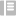

# Icon
----------------

## Usage
系統內所有 **Icon**

---
## Sample Code

### Simple Usage
```
  <icon
    iconType="iconType"
    :size="iconSize"
    >
  </icon>
```

### Icon with Hover style
```
  <icon
    iconType="iconType"
    :size="iconSize"
    enableHover
    >
  </icon>
```
---
## Props

| Prop | required | Type | Accepted Values | Default | 說明 |
|---|---|---|---|---|---|
| iconType | true | String | 見下方可用 Icons | - | Icon 樣式
| size | false | Number | - | 0 | icon 大小，單位為 px
| enableHover | false | Boolean | true / false | false | Icon 是否允許 Hover 樣式，對名稱為 'info' 的 Icon 使用enableHover，hover 時 icon 會替換成 'info_hover' 名稱的 Icon
| button | false | Boolean | true / false | false | Hover Icon 時 cursor 是否使用 pointer

---
## Events

| Event | Callback $event | 說明 |
|---|---|---|
| click | onclick event | 點擊Icon事件 |

---
## 可用 Icons

| iconType | Icon |
| --- | --- |
| menu_expand | <div style="background:black"></div> |
| menu_statistics | 
| menu_ssm | 
| menu_robot | 
| menu_wordbank | 
| menu_te | 
| menu_privilege | 
| menu_dashboard | 
| menu_intent | 
| add | 
| check | 
| checked | <div style="background:black"></div>
| close | 
| delete | 
| delete_hover | 
| delete | 
| drop_down | 
| edit | 
| edit_blue | 
| edit_white | <div style="background:black"></div>
| enterprise_admin | 
| expand | 
| help | 
| normal_acc | 
| robot | <div style="background:black"></div>
| search | 
| white_add | <div style="background:black"></div>
| daggle | 
| more | 
| setting | 
| setting_hover | 
| profile_question | 
| profile_answer | 
| info_success | 
| info_warning | 
| info_error | 
| info_close | 
| info | 
| info_hover | 
| category_add | 
| category_close | 
| category_dropdown | 
| category_open | 
| header_enterprise | <div style="background:black"></div>
| header_user | <div style="background:black"></div>
| header_dialog | <div style="background:black"></div>
| header_dropdown | <div style="background:black"></div>
| header_dropdown_gray | 
| intent | 
| info_warning_gray | 
| close_expand | 
| upload | 
| year_left | 
| year_right | 
| month_left | 
| month_right | 
